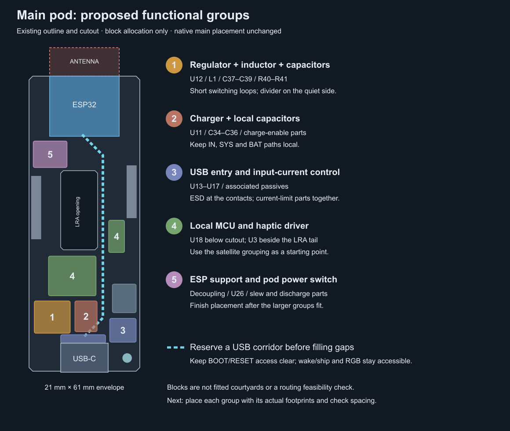

# Main board placement proposal

Placement is now user-owned. The exploratory PCB in `hardware/verification/main-placement/` was never applied and predates reset/J100 removal. Use the active main board for placement; resume routing from the user's saved result.

> Project update (2026-09-13): active sources are `hardware/main/` and `hardware/satellite/`. Main references are unchanged; historical satellite references map to the one universal design in [PCBA projects](pcba-projects.md). Any combined-board placement/count or verification statements below describe the earlier checkpoint; [current routing status](pcb-routing.md) supersedes them.

The satellite clone is complete. This is a proposed allocation for main pod 0; its native placement has not yet been changed. The drawing uses the existing 21 × 61 mm envelope and actuator opening, but the coloured blocks are space allocations rather than fitted component courtyards.

Keep the ESP32 antenna end and bottom USB receptacle as the first anchors. Preserve accessible wake/ship and RGB positions; resolve BOOT/RESET access before tightening the remaining component groups. No shell dimensions change in this proposal.

1. **Regulator group first:** U12, L1, C37–C39 and R40/R41. Keep L1 against the two switching pins, input/output capacitors against their corresponding power pins, and the feedback divider on the quiet side. C38 and C39 are currently about 31 and 34 mm from U12; R40/R41 are about 11 mm away. Their present locations should not determine the routes.
2. **Charger group beside it:** U11 with C34/C35/C36 on IN/SYS/BAT, plus Q1/R38/R39 nearby. Keep the capacitor grounds and charger thermal-pad connection local; route the wake-button ground back into this group.
3. **USB entry group:** U14/U15 beside the receptacle contacts, R60/R61 provide passive CC pull-downs. U13/U16/U17 and their supporting current-control parts are removed. R24/R25 belong by the ESP32 USB pins. The proposed right-hand USB corridor must be reserved before placing the driver and service buttons; exact route and impedance geometry remain to be worked out.
4. **Local haptic group:** U18 and its support parts below the cutout; U3 and its capacitors beside M1's flex-tail pads on the right. The satellite's component grouping is the model, but the whole pod layout does not fit this different envelope unchanged.
5. **ESP32 supply and pod switching:** Put the ESP decoupling by its supply pins. U26 and its input/output/slew components should form a compact group near the 3V3 feed and POD_3V3 distribution, outside the antenna region.

The first physical placement pass should resolve these groups in that order, then fit service headers, status circuitry and remaining pull-ups. Keep a continuous ground reference; the regulator's control-ground connection is a local routing matter, not a reason to split the board-wide ground plane. Check footprints and courtyards before treating the drawing as a demonstrated fit.

## Basis

Native footprint positions and pad nets were read from the current board. TI's cached [TPS63802 datasheet](../hardware/datasheets/TPS63802.pdf), page 28, calls for nearby input/output capacitors, separation of feedback from switching nodes, and local power/control ground connections. The [BQ25186 datasheet](../hardware/datasheets/BQ25186.pdf), page 48, calls for close IN/SYS/BAT capacitors and a solid ground connection to the thermal pad. The former TUSB320/TPS2553 guidance applies only to the archived USB circuit. Extracted passages are retained in `hardware/verification/routing-v09/*-layout.txt`.
