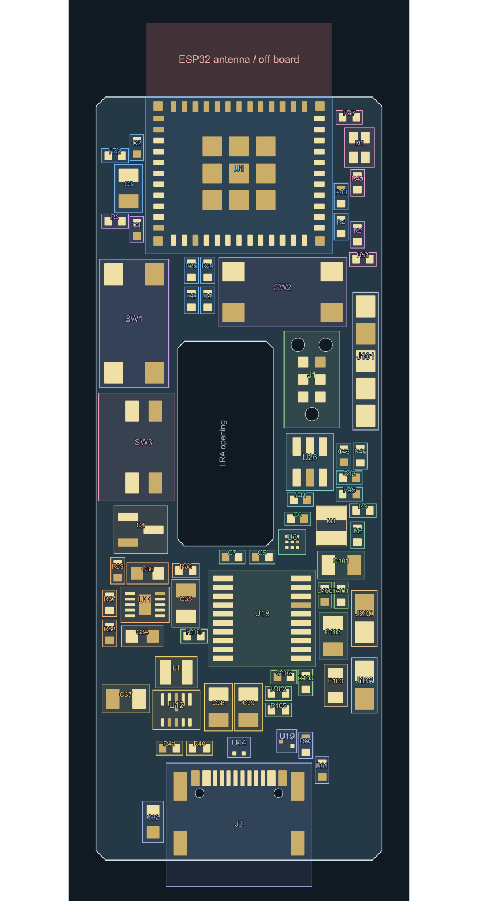

# Main board placement checkpoint

The 70-component placement is applied to `hardware/main/main.kicad_pcb` (2026-09-13). It starts from the user's functional groups, incorporates J1 Tag-Connect and omits the intentionally removed C29/C30. The older `verification/main-placement/` proposal is historical.

U1, J2, J101, J200, J103 and M1 retain their exact saved positions and rotations. The outline, antenna overhang and actuator opening are unchanged. Components remain on the front. J1 sits beside the right side of the opening; its three locating holes clear copper and board edges. D1 sits beside the ESP32 to shorten its three control connections. SW3 sits on the left; enclosure access must follow these control positions.

The charger and IN/SYS/BAT capacitors form a group below the left side of the opening. The buck-boost stage sits below that, with L1 beside its switching pins and feedback on the opposite side. The MCU occupies the lower middle; the driver sits beside the LRA contacts. USB protection stays near J2 and series resistors near the ESP32 USB pins.

## Placement evidence

The repeatable search uses native pad positions, courtyard bounds, fixed anchors, orthogonal rotations and weighted critical connections. It is a constrained placement pass, not proof of a global optimum. The preview shows pads and courtyard bounds.

| Connection | Straight-line pad-centre distance |
| --- | ---: |
| TPS63802 to L1, each switching pin | 2.02 mm |
| TPS63802 input to C37 | 1.75 mm |
| TPS63802 output to C38 / C39 | 2.14 / 4.32 mm |
| BQ25186 IN / SYS / BAT capacitors | 1.51 / 1.90 / 2.70 mm |
| M2003 supply to C100 | 1.74 mm |
| DRV2625 supply to C5 / REG to C6 | 1.86 / 1.30 mm |
| ESP32 supply to C2 | 1.60 mm |

These are geometric distances, not routed lengths or loop inductance. Routing must keep local capacitor grounds short, join regulator control ground appropriately, separate feedback from switching nodes and maintain a continuous ground reference. Secondary bulk capacitors are less tightly constrained than primary bypass capacitors.

Native checks report zero schematic/PCB mismatches and no copper, courtyard, hole or edge-clearance errors. Three warnings remain: two ESP32 silkscreen/edge warnings and the existing ESP32 footprint/library difference. Main has 196 open connections, one existing driver NRST/VDD segment and no vias. One ERC item remains for the Tag-Connect open-drain reset output and M2003 input with its internal pull-up; it is recorded explicitly. Satellite validation remains clean and its source is unchanged.

## Files and next step

- Accepted positions: `hardware/main/placement-reference.json`.
- Preview and measurements: `hardware/verification/main-placement-v2/`.
- Latest before-apply backup: `hardware/backups/pre-main-placement-v2-latest-20260913/`.
- Initial user board: `hardware/backups/user-main-groups-20260913/`.
- Current native reports: `hardware/verification/project-split/`.

Routing remains pending. Start with regulator power loops and local decoupling, then USB; use F.Cu/B.Cu for signals, In1 GND and In2 power. Retain the 6 mil minimum and avoid via-in-pad. Local placement adjustments may be needed during routing.
