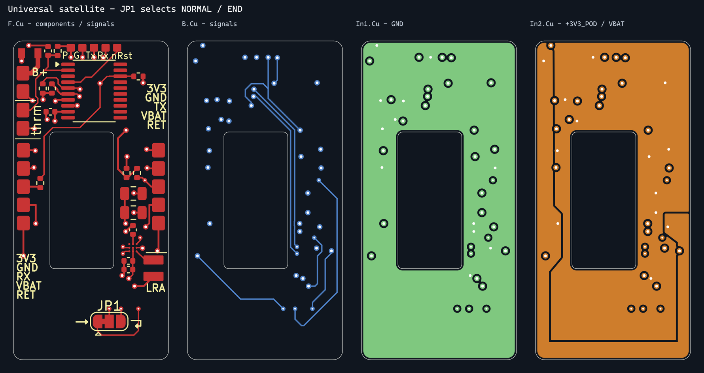

# Routing status: two PCBA masters

Current editable sources are `hardware/main/main.kicad_pcb` and `hardware/satellite/satellite.kicad_pcb`. Each has one board outline and one actuator opening. One wrist uses one main and seven identical satellites. See [project structure](pcba-projects.md).

All four images are viewed from the top, including B.Cu. [Main placement](../hardware/verification/main-placement-v2/placement.png) is separate.

## Satellite

The user's cleaned pod-6 placement and routing are retained, with local reference renumbering and JP1 in the lower bay. Both harness banks are shortened to five pads at 2 mm pitch. VBAT and return are now pins 4 and 5; their short local routes are adjusted without moving other components or adding vias. Harness reset branches and three reset vias are removed; the direct local MCU-to-ICE reset trace remains. Two existing silk guide lines were trimmed 0.2 mm from the edge, and the obsolete harness reset legends are removed. The former direct return path is split into RETURN_UP and RETURN_DOWN. JP1 selects downstream return or local TX; its new connections stay on outer copper.

| Layer | Use |
| --- | --- |
| F.Cu | Components and local signals |
| In1.Cu | GND plane |
| In2.Cu | +3V3_POD interior and VBAT perimeter strip |
| B.Cu | Signals and serial return routing |

The board remains 17 x 35 mm, four-layer, 0.8 mm nominal. It has 201 trace segments and 42 ordinary through vias. Its project now enforces a 0.1524 mm (6 mil) track minimum. Default clearance/width remain 0.20 mm, minimum via diameter/drill 0.50/0.20 mm, copper-edge clearance 0.20 mm, and DRV local clearance 0.15 mm. No microvias are used.

Fresh native DRC after refill reports **zero violations, zero opens and zero schematic parity issues**. The independent check confirms every electrical pad net, no via holes in solder pads, no inner signal tracks, aligned IN/OUT pads, and horizontal/vertical/45-degree traces.

JP1 has a factory copper net tie between 1-2. Satellites 1-6 retain it; the last board is converted to 2-3 by cutting the factory bridge and soldering the other side. Only one satellite design is maintained.

## Main

The [70-component placement checkpoint](main-board-placement.md) is applied. U1, J2, J101, J200, J103 and M1 preserve the user anchors. J1 is now the TC2030 ICE interface, replacing J102; C29/C30 are removed. The outline and actuator opening are unchanged, and the existing 6 mil driver reset/VDD tie follows the driver.

Main has 70 components, 196 open connections, three silk/library warnings and zero schematic/PCB parity issues. One ERC reset-input item remains because the M2003 internal pull-up is not represented in the symbol; satellite ERC, DRC and opens remain zero. Routing remains pending.

## Evidence

Current evidence is under `hardware/verification/project-split/`:

- `main.xml`, `satellite.xml`: fresh netlists.
- `main-erc.json`: one documented reset-input item; `satellite-erc.json`: zero violations.
- `main-drc.json`, `satellite-drc.json`: native DRC and parity.
- `main-checks.json`, `satellite-checks.json`: preserved inventory, values, circuit and placement, plus routing checks.
- Schematic PDFs/SVGs and PCB layer previews.

Run `tools/verify_split_projects.ps1` to refresh validation. Its preservation checks intentionally flag later circuit, value or placement changes; update the accepted baseline deliberately as the design evolves.

`verification/routing-v09/` and earlier routing directories are historical combined-board checkpoints. `archive/combined-project/` contains the superseded native project; `backups/before-two-projects/` preserves the starting redraw and hashes. Earlier construction scripts are migration provenance, not active generators.

JLCPCB remains preferred. Exact production stack, main USB geometry and manufacturing panel remain pending. No fabrication files have been released. Physical fit, power sequencing and bench behavior are separate checks.
