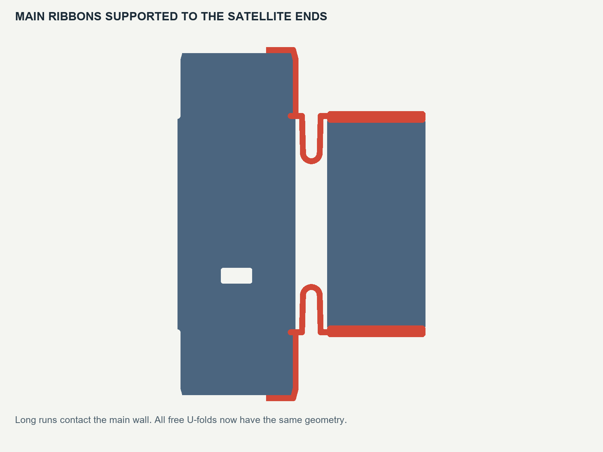
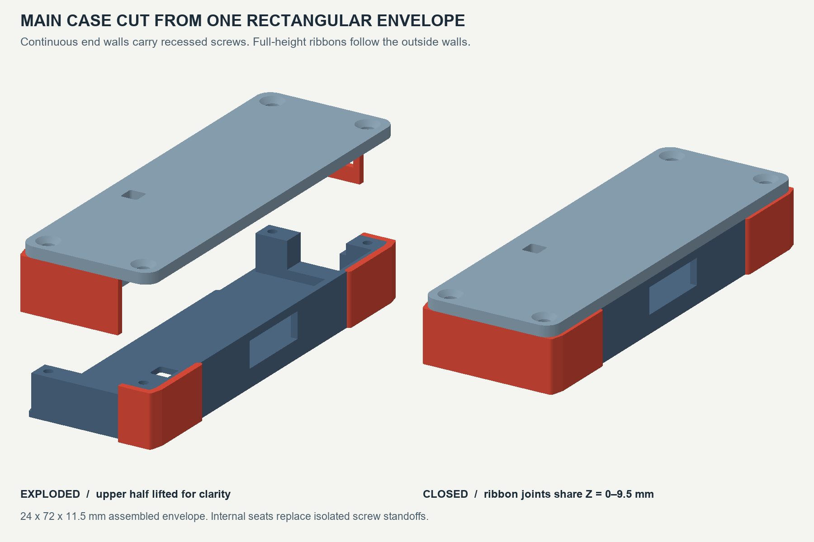
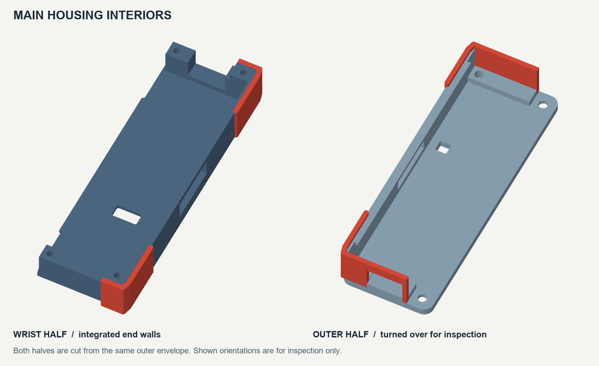

# Main-pod refinement — v0.11

This revision addresses the user's v0.10 slicer screenshot. The long TPU sections beside the main pod now contact its outside walls down to the satellite end positions (local Y=±22 mm). All sixteen free U-folds use the same geometry, with a 1.2 × 9.5 mm ribbon cross-section. Matching free geometry removes the deliberately longer main free legs; actual joint stiffness still needs a printed trial.

The main case is rebuilt by subtracting the cavity, access openings and mating cuts from one **24 × 72 × 11.5 mm rectangular envelope with rounded corners**. It closes into a continuous box exterior, with the service openings retained. Continuous internal end walls replace the isolated standoffs. Two cavity depths leave the PCB bearing ledges in the original solid. The wrist-facing floor and outward-facing roof still print at opposite strip ends.

The stepped seam keeps the ribbon ends at a common Z=0–9.5 mm. They butt together at the wall handoff when the case closes. Pockets in the lower half receive the upper half's TPU inlays. Main end ribbons are 1.2 mm wide; satellite embedded end rails remain 2.4 mm wide. The narrower main inlay leaves 1.2 mm of nominal rigid material between each end-wall pilot and the adjacent cavity/inlay boundary. A local USB cutout remains in the embedded rail, clear of the butt joints and free folds.

## Files and printing

| File | Purpose |
|---|---|
| [Full strip 3MF](print/myo-flat-band.3mf) | One dual-material strip, nine rigid pieces forming eight assembled pods |
| [Satellite lid](print/satellite-lid.stl) | Print seven; main roof is already in the strip |
| [Main transition coupon](print/main-transition-coupon.3mf) | New supported main-to-satellite joint |
| [Main fit parts](print/main-clamshell-fit-parts.stl) | Both main halves for a small fit trial |
| [Terminal closure coupon](print/closure-transition-coupon.3mf) | Upper main half and last satellite |
| [Satellite coupon](print/end-flexure-coupon.3mf) | Retained two-satellite joint |
| [Flat STEP](cad/flat-strip.step) | Full strip with separate rigid and soft bodies |
| [Assembled main STEP](cad/main-clamshell-assembled.step) | Both main halves at their closed datums |
| [CAD source](../../tools/build_myo_flat_v011.py) | Editable generator |
| [Overview](design-overview.png) | Actual flat meshes and illustrative oval pose |

The **239.2 × 72 × 11.5 mm** strip retains the H2D layout. Assign PET-GF15 and TPU to the aligned rigid/soft parts and retain their common coordinates. The generic 3MF contains material labels, not a printer process preset; bonding remains slicer-managed as requested. Support is still needed under the terminal main roof and wall feet. Do not independently drop the upper rigid half to the bed: its wall feet start at Z=1 mm while its attached TPU starts at Z=0. Satellite shells, lids and free joint geometry are retained.

**Main fasteners change to four M2 × 8 mm countersunk screws.** Modeled engagement is 4 mm in the two internal end walls and 6 mm on the opposite side, with 1 mm tip-to-pilot-bottom clearance. Satellite fasteners remain fourteen M2 × 5 mm countersunk screws. Seats assume 90-degree heads, 4.1 mm diameter, and 1.6 mm pilots. Check pilot fit and torque using the main fit parts in the chosen PET-GF15.

Print the new main transition coupon and clamshell fit parts first. Check sidewall bonding, equal/unequal fold motion, support removal, case closure and screw fit before the complete band. Keep the seven wired gaps and one unwired gap; populated component fit, board retention and harness strain relief remain physical development work.

## Evidence

`cad-checks.json` records valid CAD and STEP reimports, board/cell/USB clearance, all sixteen neighbor contacts, four main sidewall-contact gauges, full-height butt-joint gauges, and sampled closing motion including attached TPU. `revision-checks.json` compares retained satellite geometry against the frozen v0.10 STEP. `mesh-checks.json` checks the raw exported STLs, and `delivery-checks.json` verifies archive structure and previous-release/source preservation.

The user supplied a **v0.10 slicer view**. **v0.11 is CAD/mesh checked, but has not been sliced, printed or fit-confirmed.** Joint stiffness, fatigue, comfort and operating performance are not established by these checks. The oval pose is illustrative rather than a mechanics simulation.

Regenerate with build123d: `python tools/build_myo_flat_v011.py --wrist-mm 195 --wall-mm 1.2`. Rendering uses NumPy/trimesh/Pillow and `tools/render_myo_flat_v011.py`. The ZIP includes the generator, earlier helper modules, and read-only PCB/dimension inputs. Earlier revisions are preserved.
